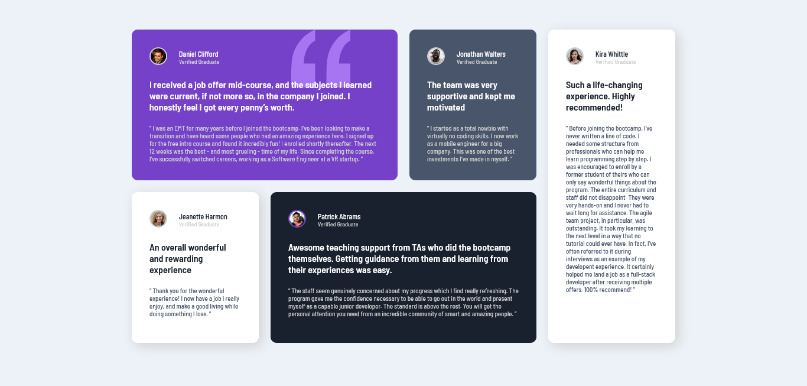

# Frontend Mentor - Testimonials grid section solution

Esta es una solución al [desafío de la sección de testimonios en forma de cuadrícula en Frontend Mentor](https://www.frontendmentor.io/challenges/testimonials-grid-section-Nnw6J7Un7).

## Tabla de contenido

- [Resumen](#resumen)
  - [El desafío](#el-desafío)
  - [Captura de pantalla](#captura-de-pantalla)
  - [Enlaces](#enlaces)
- [Mi proceso](#mi-proceso)
  - [Desarrollado con](#desarrollado-con)
  - [Lo que aprendí](#lo-que-aprendí)
  - [Desarrollo continuo](#desarrollo-continuo)
  - [Recursos útiles](#recursos-útiles)
- [Autor](#autor)

## Resumen

### El desafío

Los usuarios deberían poder:

- Ver el diseño óptimo para el sitio dependiendo del tamaño de pantalla de su dispositivo

### Captura de pantalla

### Enlaces

- URL de la solución: [GitHub](https://github.com/ReyCrisGit/Testimonials-grid-section-solution.git)
- URL del sitio en vivo: [GitHubPages](https://reycrisgit.github.io/testimonials-grid-section-main/)

## Mi proceso

### Desarrollado con

- Marcado semántico HTML5
- CSS custom properties
- Flexbox
- CSS Grid
- Mobile-first workflow

### Lo que aprendí

Aprendí a aplicar CSS Grid en el proyecto

### Desarrollo continuo

Dominar FlexBox y CSS Grid. Luego poner en práctica JavaScript para los demás desafíos.

### Recursos útiles

Los videos de [Jordan Alexander](https://www.youtube.com/@AlexCGDesign). Me ayuda mucho con las buenas prácticas.

## Autor

Sitio web - [Cristian Barrios](https://github.com/ReyCrisGit)
Frontend Mentor - [Cristian Barrios](https://www.frontendmentor.io/profile/ReyCrisGit)